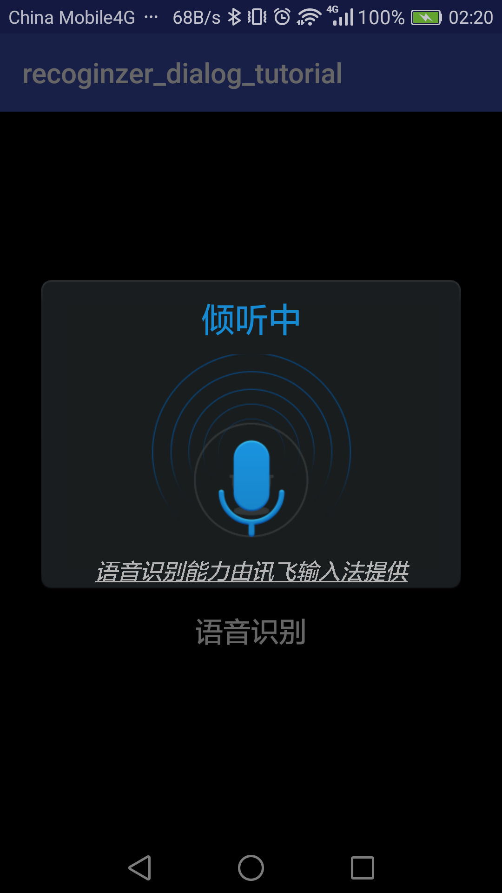

# A tutorial of iflytek class RecognizerDialog
## Read these files for more details:
- [`AndroidManifest.xml`](./recoginzer_dialog_tutorial/app/src/main/AndroidManifest.xml): adds permissions for the App
- [`activity_main.xml`](./recoginzer_dialog_tutorial/app/src/main/res/layout/activity_main.xml): contains layout designs
- [`MainActivity.java`](./recoginzer_dialog_tutorial/app/src/main/java/cxy/recoginzer_dialog_tutorial/MainActivity.java): contains the major codes for the App

## Screenshots
<figure class="half">
    
    
</figure>
